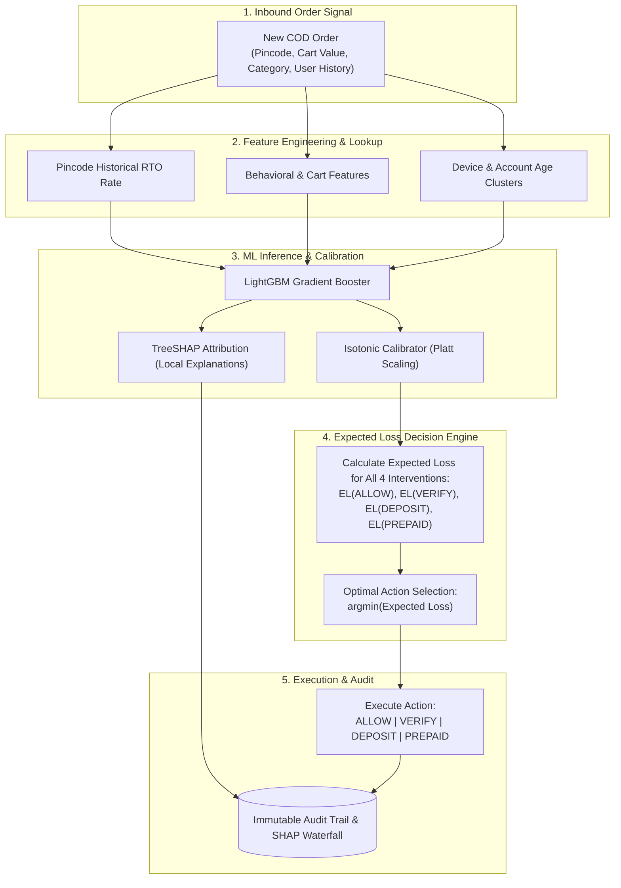

<div align="center">

# 🛡️ RTO Shield
### AI Risk Manager & Cost Engine for Indian E-Commerce COD Orders

[](https://rto-shield-nlthpydtndpkupyfgfl3yy.streamlit.app)
[](https://python.org)
[](https://lightgbm.readthedocs.io)
[](tests/)
[](#-decision-engine-latency)
[](LICENSE)

<p align="center">
  <b>Transforming Cash-on-Delivery (COD) risk prediction into profit-maximizing interventions:</b><br/>
  Combines calibrated probability estimation, TreeSHAP explainability, and an expected-loss decision matrix to protect merchant margins against Return-to-Origin (RTO) logistics waste.
</p>

</div>

---

> 📄 **Executive Resources**: **[Executive Brief (PDF)](docs/executive_brief.pdf)** · **[Interactive HTML](https://htmlpreview.github.io/?https://github.com/mahirbhat70-eng/rto-shield/blob/main/docs/executive_brief.html)** · **[Decision Audit Claim Matrix](claim-matrix.md)**

---

## ⚡ Quickstart (Under 5 Minutes)

```bash
# 1. Clone repository
git clone https://github.com/mahirbhat70-eng/rto-shield.git
cd rto-shield

# 2. Install dependencies
pip install -r requirements.txt

# 3. Run full automated test suite (225 passing tests)
pytest tests/ -q

# 4. Launch interactive 4-view decision dashboard
streamlit run dashboard.py
```
👉 *Or explore the live hosted deployment without installing:* **[rto-shield-nlthpydtndpkupyfgfl3yy.streamlit.app](https://rto-shield-nlthpydtndpkupyfgfl3yy.streamlit.app)**

---

## 💡 The Core Problem: Why Predicting P(RTO) Isn't Enough

Predicting probability is not the end-product — **deciding the financially optimal intervention is.**

In Indian e-commerce, reverse logistics for an RTO order costs a merchant **₹150+ in dead freight**, destroying profitability. However, bluntly blocking high-risk orders drops paying customers and forfeits revenue. 

RTO Shield replaces binary classification with a **4-action Cost Engine** that minimizes Expected Loss:

$$\text{EL}(a) = \text{Friction Cost}(a) + P_{\text{RTO}}(a) \times ₹150 - P_{\text{Success}}(a) \times \text{Margin}$$

$$\text{Margin} = \text{Order Value} \times 20\%$$

### 🎯 The Four Action Policies
| Action | Intervention Mechanism | Customer Friction | Best Suited For |
|---|---|---|---|
| **`ALLOW`** | Seamless fulfillment | ₹0 | Low-risk orders, high-margin VIP customers |
| **`VERIFY`** | Automated WhatsApp / IVR address confirmation | ₹2 | Borderline uncertainty; filters typo & bogus addresses |
| **`DEPOSIT`** | Request partial pre-payment (₹50–₹100 advance) | Modest | High-risk, low-ticket orders where reverse logistics exceeds margin |
| **`PREPAID`** | Require 100% digital payment (UPI / Card) | High | Severe repeat fraud or known serial RTO addresses |

---

## 🏛️ Decision Flow Architecture



---

## 📊 Empirical Results (Held-Out Test Set, N=7,174)

Every claim traces to frozen artifacts in `reports/` and is validated against 11/11 pre-registered checks on a strictly held-out temporal test window:

- **COD-Subset Baseline RTO Rate:** 28.27%
- **Mean Calibrated P:** 0.2832
- **Average Order Value:** ₹826.89 (Median: ₹607.57)

### 📈 Policy Comparison vs. Baselines
| Strategy | Total Loss (INR) | Net Savings vs Baseline | Action Distribution (ALLOW / VERIFY / DEPOSIT / PREPAID) | RTOs Prevented | Good Customer Drops |
|---|---|---|---|---|---|
| **1. Baseline (Always Allow)** | −₹547,766 | ₹0 | 100% / 0% / 0% / 0% | 0 | 0 |
| **2. Single Threshold: PREPAID (0.48)** | −₹548,696 | ₹930 | 99.3% / 0% / 0% / 0.7% | 17.0 | 12.6 |
| **3. Single Threshold: VERIFY (0.20)** | −₹583,686 | ₹35,919 | 17.0% / 83.0% / 0% / 0% | 546.5 | 206.6 |
| **4. Multi-Action Cost Engine (Ours)** | **−₹619,508** | **₹71,741** | **18.4% / 45.2% / 36.4% / 0.0%** | **951.2** | **820.1** |

> 🏆 **Key Finding**: The multi-action cost engine earns **2.0× the savings [1.23×, 2.39× bound]** of the best single-threshold policy, delivering a **13.1% portfolio profit uplift**.

---

## ⏱️ Decision Engine Latency

Benchmarked across the full end-to-end scoring pipeline (`feature resolution` → `LightGBM inference` → `TreeSHAP explainability` → `expected-loss matrix resolution`):

| Percentile | Latency | Target SLA |
|---|---|---|
| **p50** | **~8 ms** | < 25 ms |
| **p95** | **~11 ms** | < 50 ms |
| **p99** | **~15–30 ms** | < 100 ms |

*Reproduce via `python scripts/benchmark_latency.py`.*

---

## 🔍 Feature Attribution: What Drives RTO Risk?

TreeSHAP feature importance aggregated by feature families:

```text
COD Risk Factors:
├── COD Payment Family (34.6%)        [cod_charge, payment_method_COD]
├── Geographic / Pincode (24.3%)      [historical_pincode_rto_rate, pincode_tier]
└── Customer Behavior (41.1%)
    ├── Prior RTO Count: 10.0%
    ├── Merchandise Category: 7.4%
    ├── Account Age: 7.3%
    └── Order Value & Device: 16.4%
```

---

## 📁 Repository Map

```text
rto-shield/
├── app.py                     # Streamlit Single-Order Real-time Scorer
├── dashboard.py               # 4-View Decision Console (Command Center, Live Engine, Frontier, Audit)
├── configs/
│   ├── data_config.yaml       # Feature groupings & schema constraints
│   └── cost_config.yaml       # Intervention unit costs & expected loss parameters
├── src/
│   ├── data/                  # Synthetic generation & temporal split validation
│   ├── models/                # Rule-based, Logistic Regression & LightGBM implementations
│   ├── policy/                # Cost engine, multi-action router & threshold curves
│   ├── serve/                 # Real-time scoring pipeline & TreeSHAP generation
│   └── eval/                  # Calibration curves, Bayes ceiling, and held-out test reveal
├── tests/                     # 225 unit, integration, and property tests across 14 modules
├── reports/                   # Audit-ready benchmark results, figures, and stage reports
└── scripts/                   # Latency benchmarks, hash freezing, and sensitivity analyses
```

---

## 🔬 Test Suite & Quality Gates

The test suite covers:
- **Generator Contracts & Split Leakage**: Verifies strict temporal causality (Train → Validation → Held-Out Test).
- **Metric Invariants**: Mathematically proves dominance of multi-action expected loss.
- **Serving Path Equivalence**: Asserts identical predictions between batch evaluation and single-order real-time scoring.
- **Explainability Validation**: Verifies positive SHAP contributions strictly correlate with higher RTO likelihood.

```bash
# Run the complete test suite
pytest tests/ -v
```

---

## ⚖️ Honest Engineering Limitations

- **Synthetic Generator Basis**: Metrics represent upper bounds under a stationary data generation process.
- **Single-Order Horizon**: The expected loss model optimizes unit economics per order; customer lifetime value (LTV) impacts of dropped customers are not modeled.
- **Calibration Tradeoff**: Isotonic probability calibration trades ₹10.8k of theoretical test savings for forecast reliability that does not collapse out-of-sample.

---

## 📄 License
This project is licensed under the MIT License. See `LICENSE` for details.
