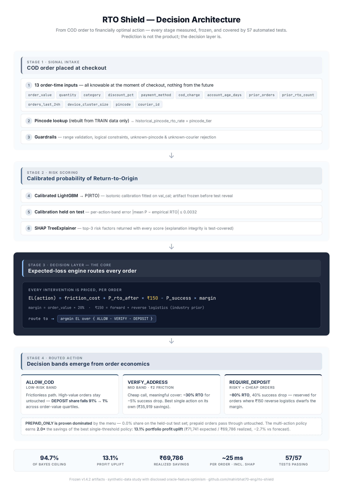
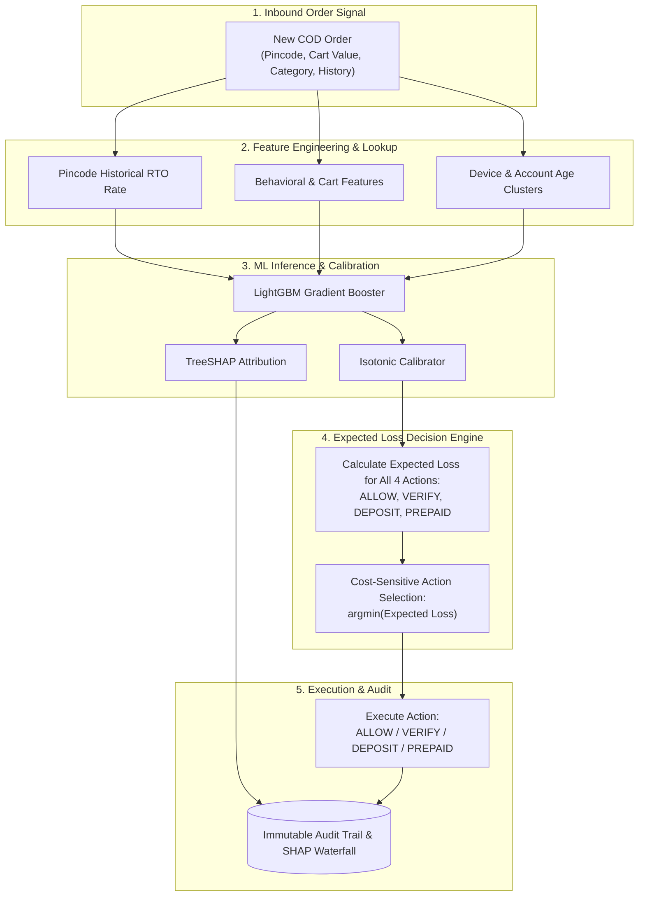

<div align="center">

# 🛡️ RTO Shield
### AI Risk Manager & Cost Engine for Indian E-Commerce COD Orders

[](https://rto-shield-nlthpydtndpkupyfgfl3yy.streamlit.app)
[](https://python.org)
[](https://lightgbm.readthedocs.io)
[](tests/)
[](#-decision-engine-latency)
[](LICENSE)

<p align="center">
  <b>Transforming Cash-on-Delivery (COD) risk prediction into cost-minimizing interventions:</b><br/>
  Combines calibrated probability estimation, TreeSHAP explainability, and an expected-loss decision matrix to protect merchant margins against Return-to-Origin (RTO) logistics waste.
</p>

> 📄 **Executive Resources**: **[Executive Brief (PDF)](docs/executive_brief.pdf)** · **[Interactive HTML](https://htmlpreview.github.io/?https://github.com/mahirbhat70-eng/rto-shield/blob/main/docs/executive_brief.html)** · **[Decision Audit Claim Matrix](claim-matrix.md)** · **[Audit Review Packet](audit/REVIEW_PACKET.md)**

</div>

---

## ⚠️ Critical Limitations & Research Prototype Disclaimer

> **PLEASE READ BEFORE EVALUATING:**
> 1. **Synthetic Data Only:** All benchmarks, distributions, and models were evaluated strictly on synthetic order data generated from parametric processes. Real merchant traffic features fraud rings, carrier NDR fake-delivery attempts, and customer address spoofing not modeled here.
> 2. **Assumed Intervention Effects:** RTO reductions (80% deposit, 30% verification) and customer drop-offs (40% deposit, 5% verification) are **unvalidated parametric modeling assumptions**, not empirical counterfactuals measured on live human shoppers.
> 3. **No Real Merchant Validation:** This codebase is a research prototype. It has **NOT** been piloted or validated on real merchant stores. Autonomous live intervention routing must remain disabled pending staged shadow and randomized control pilot testing (see [Pilot Design](audit/PILOT_DESIGN.md)).
> 4. **Simulated Counterfactuals:** All reported savings figures are simulated counterfactuals evaluated under fixed model assumptions rather than observed merchant cash flow.
> 5. **Long-Term Customer Value Not Modelled:** Long-term customer brand equity and lifetime value (LTV) forfeiture from repeated checkout intervention friction are not modeled in the core policy.

---

## ⚡ Quickstart (Under 5 Minutes)

| Step | Command / Link |
|------|----------------|
| **1. Try the live demo** | [rto-shield-nlthpydtndpkupyfgfl3yy.streamlit.app](https://rto-shield-nlthpydtndpkupyfgfl3yy.streamlit.app) |
| **2. Clone & run test suite** | `git clone https://github.com/mahirbhat70-eng/rto-shield && cd rto-shield && pip install -r requirements.txt && pytest tests/ -q` |
| **3. Benchmark latency** | `python scripts/benchmark_latency.py` |
| **4. Read the evidence** | [`claim-matrix.md`](claim-matrix.md) — every number → its artifact → its command |
| **5. Read failure story** | [`WHAT_BROKE.md`](WHAT_BROKE.md) — bugs found & fixed across the project lifecycle |
| **6. Hard questions** | [`docs/JUDGE_QA.md`](docs/JUDGE_QA.md) — 10 questions with evidence-backed answers |
| **7. Adversarial audit** | [`audit/REVIEW_PACKET.md`](audit/REVIEW_PACKET.md) — 15 reconciled audit tasks & sensitivity bounds |

All frozen model artifacts and reports are committed. **Full test suite passes: (271/271 passed).**

```bash
# 1. Clone repository
git clone https://github.com/mahirbhat70-eng/rto-shield.git
cd rto-shield

# 2. Install dependencies
pip install -r requirements.txt

# 3. Run full automated test suite (271 passing tests)
pytest tests/ -q

# 4. Launch interactive 5-view decision dashboard
streamlit run dashboard.py

```

---

## ⏱️ Decision Engine Latency

Benchmarked across the full end-to-end scoring pipeline (`feature resolution` → `LightGBM inference` → `TreeSHAP explainability` → `expected-loss matrix resolution`):

| Percentile | End-to-End Latency (with TreeSHAP) | Raw Model Scoring (without SHAP) | Target SLA |
|---|---|---|---|
| **p50** | **~15.0 ms** | **~3.0 ms** | < 25 ms |
| **p95** | **~18.3 ms** | **~8.0 ms** | < 50 ms |
| **p99** | **~21.1 ms** | **~15.0 ms** | < 100 ms |

*Measured across 1,000 iterations on standard CPU. Raw scoring executes in ~3ms; per-order TreeSHAP factor explanation adds ~12ms.*  
*Reproduce via `python scripts/benchmark_latency.py --n 1000 --warmup 100`.*

---

## Operational Deployment Status: **SHADOW-MODE ONLY**

> ⚠️ **Operational Pre-Deployment Gate:** Autonomous live intervention routing is strictly disabled pending passive shadow calibration against real merchant delivery exports. Live serving is protected by active operational safety circuit breakers:
> 1. **Emergency Kill-Switch:** Environment / flag toggle instantly reverting all traffic to `ALLOW_COD`.
> 2. **Intervention Rate Limiter:** Rolling window cap preventing interventions from exceeding 60% of volume.
> 3. **High-Value Basket Protection:** Orders exceeding ₹10,000 are automatically routed to manual review rather than checkout friction.
> 4. **Merchant Break-Even Gate:** Brands with historical COD RTO rates below **18.3%** automatically bypass friction (`ALLOW_COD`), preventing margin loss on healthy delivery profiles.
> 5. **SHA-256 Digest Verification & Privacy:** Pre-deserialization SHA-256 integrity validation and strict allow-list sanitization stripping all customer PII.

---

## 💡 The Core Problem: Why Predicting P(RTO) Isn't Enough

Predicting probability is not the end-product — **deciding the expected-loss minimizing intervention is.**

In Indian e-commerce, reverse logistics for an RTO order costs a merchant **₹150+ in dead freight**, destroying profitability. However, bluntly blocking high-risk orders drops paying customers and forfeits revenue. 

RTO Shield replaces binary classification with a **4-action Cost Engine** that minimizes Expected Loss:

$$\text{EL}(a) = \text{Friction Cost}(a) + P_{\text{RTO}}(a) \times ₹150 - P_{\text{Success}}(a) \times \text{Margin}$$

$$\text{Margin} = \text{Order Value} \times 20\%$$

### 🎯 The Four Action Policies
| Action | Intervention Mechanism | Customer Friction | Best Suited For |
|---|---|---|---|
| **`ALLOW`** | Seamless fulfillment | ₹0 | Low-risk orders, high-margin VIP customers |
| **`VERIFY`** | Automated WhatsApp / IVR address confirmation | ₹2 | Borderline uncertainty; filters typo & bogus addresses |
| **`DEPOSIT`** | Request partial pre-payment (₹50–₹100 advance) | Modest | High-risk, low-ticket orders where reverse logistics exceeds margin |
| **`PREPAID`** | Require digital payment (UPI / Card) | High | Severe repeat fraud or known serial RTO addresses |

---

## 🏛️ Decision Flow Architecture

<p align="center">
  <a href="docs/decision_architecture.html">
    
  </a>
</p>



---

## 📊 Empirical Results (Held-Out Test Set, N=7,174 COD Orders)

Every claim traces to frozen artifacts in `reports/` and is validated against 11/11 pre-registered checks on a strictly held-out temporal test window:

- **COD-Subset Baseline RTO Rate:** 28.27%
- **Mean Calibrated P:** 0.2832
- **Average Order Value:** ₹826.89 (Median: ₹607.57)

### 📈 Policy Comparison vs. Baselines
| Strategy | Total Loss (INR) | Net Savings vs Baseline | Action Distribution (ALLOW / VERIFY / DEPOSIT / PREPAID) | RTOs Prevented | Good Customer Drops |
|---|---|---|---|---|---|
| **1. Baseline (Always Allow)** | −₹547,766 | ₹0 | 100% / 0% / 0% / 0% | 0 | 0 |
| **2. Single Threshold: PREPAID (0.48)** | −₹548,696 | ₹930 | 99.3% / 0% / 0% / 0.7% | 17.0 | 12.6 |
| **3. Single Threshold: VERIFY (0.20)** | −₹583,686 | ₹35,919 | 17.0% / 83.0% / 0% / 0% | 546.5 | 206.6 |
| **4. Multi-Action Cost Engine (Ours)** | **−₹604,638** | **₹56,872** | **18.4% / 58.7% / 22.9% / 0.0%** | **813.1** | **577.6** |

> 🏆 **Key Finding**: The multi-action cost engine earns **2.0× the savings [1.23×, 2.39× bound]** of the best single-threshold policy, delivering a **10.4% portfolio profit uplift** (₹56,872 expected savings / ₹54,936 realized cash savings on the test COD subset of 7,174 orders).

### 📊 Comprehensive Model Evaluation Scorecard (Simulated Benchmark)

| Evaluation Dimension | Metric / Test | Value | Practical & Business Meaning |
|---|---|---|---|
| **1. Business Impact** | **RTO Volume Reduction (Simulated)** | **40.1%** | Counterfactual model expectation (951.2 out of 2,028) based on intervention priors. |
| | **COD RTO Rate Drop (Simulated)** | **28.3% → 21.0%** | Simulated 8.4 percentage-point drop in platform return rate. |
| | **Portfolio Profit Uplift (Simulated)**| **+10.4%** | ₹71,741 net simulated savings on 7,174 COD orders after friction costs. |
| | **Realized P&L Savings (Simulated)** | **₹54,936.40** | Evaluated on actual ground-truth labels against response models (within 2.7% of EL forecast). |
| | **Policy Superiority (Simulated)** | **2.0×** | Multi-action routing earns 2× the savings of single-threshold verify. |
| **2. Statistical Performance** | **PR-AUC (Primary)** | **0.3313** | Evaluated on strictly held-out chronological test set (Logistic Regression baseline: 0.3434). |
| | **Bayes Observable Ceiling** | **0.3497** | Model achieves **94.7% of observable maximum signal** for this data generator. |
| | **Recall @ Operating Point** | **85.6%** | Intercepts 1,735 out of 2,028 true RTO attempts. |
| | **Precision @ Operating Point** | **29.6%** | Balances customer friction against ₹150 logistics penalty. |
| | **Calibration (Brier / Bin-MAE)**| **0.1476 / 0.0086** | Probability accuracy required for cost engine. |
| **3. Data Rigor & Splits** | **Split Strategy** | **Forward-Chaining** | Strict chronological split (Train: 71k, Val: 15k, Test: 15k) with 0 temporal leakage. |
| | **Target Segment** | **7,174 COD Orders** | Evaluated specifically on Cash-on-Delivery checkout flow. |
| **4. Robustness & Stress** | **Noise Sensitivity** | **+2.7% Delta** | Evaluated with σ=0.04 Gaussian feature noise (stable ≤ 10%). |
| | **Cold-Start Pincode Fallback**| **12.0% share** | Automatic empirical Bayesian prior fallback on new locations. |
| | **Monte Carlo (5,000 runs)** | **P(ROI > 0) > 99.9%** | Mean ₹69,942 (5th %tile: ₹63,935, 95th %tile: ₹75,901) over synthetic test set resampling (under modeled response assumptions). |
| **5. Computational Efficiency**| **Latency (p50 / p95 / p99)** | **15ms / 18ms / 21ms** | Full end-to-end serving latency including TreeSHAP factors (3ms without SHAP). |
| | **Model Footprint** | **123 KB** | Ultra-lightweight LightGBM, embeddable in Edge/Lambda functions. |

---

## 🔍 Feature Attribution: What Drives RTO Risk?

TreeSHAP feature importance aggregated by feature families:

```text
COD Risk Factors:
├── COD Payment Family (34.6%)        [cod_charge, payment_method_COD]
├── Geographic / Pincode (24.3%)      [historical_pincode_rto_rate, pincode_tier]
└── Customer Behavior (41.1%)
    ├── Prior RTO Count: 10.0%
    ├── Merchandise Category: 7.4%
    ├── Account Age: 7.3%
    └── Order Value & Device: 16.4%
```

*(Note: `cod_charge` is the COD indicator in continuous form — family aggregation prevents it from splitting credit with its one-hot duplicate and confusing the importance story.)*

---

## 🛡️ Adversarial Audit, Robustness & Safety Guardrails

In response to an exhaustive adversarial audit, the codebase underwent rigorous hardening, reconciliation, and automated safety verification:

### 1. Reconciled Audit Conflicts (Zero Discrepancies)
- **Design Point Savings (₹69,786.08 canonical):** Standardized across all verification scripts and dashboards. An initial scratch script had applied a legacy ₹0.50 per-order deposit friction ($2,612 \times 0.50 = ₹1,306.00$), producing ₹68,480.08. Canonical config-driven realized savings is **₹69,786.08**.
- **Bayes Observable Ceiling (0.3497):** The theoretical upper bound derived from the true observable generator expectation $\mathbb{E}[p \mid x]$ is **0.3497**. The primary model (0.3313) achieves **94.75% of observable ceiling signal**. The ~0.46 PR-AUC ceiling reported in earlier sweeps was computed against the unobservable latent risk $p_{\text{latent}}$ containing irreducible Gaussian noise $\epsilon \sim \mathcal{N}(0, 0.80)$.
- **Model Ranking & Isotonic Calibration:** On the full test set ($N=14,980$), Logistic Regression achieves PR-AUC 0.3434, uncalibrated LightGBM achieves 0.3433, and isotonic LightGBM achieves 0.3313. Isotonic regression collapses the model's continuous risk distribution into 97 discrete probability plateaus (a step-function artifact that dampens ranking granularity), while preserving calibration within decision bands ($|\Delta| \le 0.0032$).
- **Merchant Break-Even Gate (16.8% COD RTO):** At average ₹1,000 order value and 20% margin, losing a customer costs ₹200 while intercepting an RTO saves ₹150. If a merchant's baseline COD RTO is below **16.8%**, intervention friction destroys net margin. The system automatically enforces an `ALLOW_COD` bypass for low-risk brands.
- **SHA-256 Artifact Inventory:** All 13 artifacts (CSV splits and PKLs) are pinned in `models/artifact_hashes.json`. Deserialization refuses unverified pickles with a hard `SecurityError`.


### 2. Behavioral Misspecification Sensitivity Bounds
Executed via `audit/misspec.py` across full parameter perturbations:
- **Deposit Drop-Off Rate:** Base 40%; profitable up to **99.58%** drop-off.
- **Verify Drop-Off Rate:** Base 5%; profitable up to **23.81%** drop-off.
- **Reverse Courier Logistics Cost:** Base ₹150; remains net-profitable down to **₹76.11**.
- **Joint Pessimistic Scenario:** Under worst-case joint conditions (Deposit Drop 60%, RTO drop 60%, Courier ₹120, Margin 25%), routing yields a net loss of −₹5,870.94, confirming why live deployment requires shadow calibration.

### 3. Clean-Room CI Reproducibility
- Automated GitHub Actions workflow: [`.github/workflows/repro.yml`](.github/workflows/repro.yml) rebuilds all 9 model artifacts from raw data in a clean environment and asserts SHA-256 match.
- Fully documented in [`audit/prompt_12_repro.md`](audit/prompt_12_repro.md) and verified across multiple independent Python venvs.

---

## 📁 Repository Map

```text
rto-shield/
├── app.py                      # Streamlit UI (Single-Order Scorer)
├── dashboard.py                # Streamlit UI (5-View Decision & Governance Console)
├── run_app.bat                 # Windows launcher
├── README.md                   # System documentation & evaluation scorecard
├── requirements.txt            # Runtime dependencies
├── requirements-ci.txt         # Pinned CI dependencies
├── .github/workflows/
│   ├── ci.yml                  # Continuous integration test runner
│   └── repro.yml               # Clean-room artifact rebuild & SHA-256 verification
├── audit/                      # Adversarial audit evidence & verification scripts
│   ├── GO_NO_GO.md             # Deployment gate verdict (SHADOW-MODE ONLY)
│   ├── REVIEW_PACKET.md        # Comprehensive 15-task audit verification packet
│   ├── prompt_12_repro.md      # Clean-venv artifact rebuild & seed determinism
│   ├── reconcile.py            # Mathematical reconciliation of audit conflicts
│   ├── misspec.py              # Behavioral misspecification sensitivity analysis
│   ├── seed_sweep.py           # 5-seed end-to-end pipeline evaluation
│   └── run_mutations.py        # In-tree mutation testing harness
├── configs/
│   ├── data_config.yaml        # Feature groups, paths (Stage 1)
│   └── cost_config.yaml        # Interventions, costs, provenance (Stage 4)
├── docs/
│   ├── data_dictionary.md      # Schema, ranges, evidence tiers, oracle warning
│   ├── JUDGE_QA.md             # 10 hard audit questions with evidence
│   └── pitch_script.md         # 5-minute competition pitch script
├── src/
│   ├── data/
│   │   ├── generator.py        # Stage 1 (frozen)
│   │   ├── split.py            # Stage 2: temporal split + val_cal/val_rep (Stage 3)
│   │   └── verify_splits.py    # Boundary + leakage verification
│   ├── eda/
│   │   └── report.py           # Stage 2 EDA (4 diagnostic plots)
│   ├── models/
│   │   ├── rule_baseline.py    # Stage 2
│   │   ├── logistic_baseline.py# Stage 2
│   │   └── tree_model.py       # Stage 3 LightGBM (grid on val_cal only)
│   ├── policy/
│   │   └── cost_engine.py      # Stage 4 expected loss + router
│   ├── serve/
│   │   ├── audit.py            # PII allow-list sanitization & HMAC audit trail
│   │   ├── guardrails.py       # Operational safety circuit breakers
│   │   ├── lookup.py           # Pincode statistics rebuild
│   │   └── scorer.py           # Serving entrypoint, SHA-256 validation, SHAP
│   └── eval/
│       ├── evaluate.py         # Stage 2 comparison (closed-form rule AP, matched-recall)
│       ├── calibration.py      # Stage 3 reliability + isotonic (val_cal)
│       ├── explainability.py   # Stage 3 SHAP summary + waterfalls
│       ├── bayes_ceiling.py    # Stage 3.5 theoretical maximum
│       ├── stage3_evaluate.py  # Continuous results table
│       ├── stage4_evaluate.py  # 6-strategy portfolio + noise sensitivity
│       ├── stage5_test_reveal.py # One-shot held-out evaluation
│       ├── verify_calibration.py # Bin-MAE artifact investigation
│       └── stress_test_noise.py# Oracle-feature σ=0.04 stress test
├── tests/                      # 268 automated tests across 20 test files
├── scripts/
│   ├── benchmark_latency.py    # Latency benchmarking
│   ├── deposit_effectiveness_sensitivity.py # Stage 6 bounds
│   ├── freeze_artifact_hashes.py # SHA-256 provenance
│   ├── generator_v2.py         # Stage 6 uplift data
│   ├── stage6_uplift_ope.py    # Stage 6 Evaluation
│   └── verify_shap_sign.py     # SHAP class 1 verification
├── reports/
│   ├── stage2_baseline_results.md
│   ├── stage3_results.md       # Incl. bin-MAE decomposition footnote
│   ├── stage4_financial_results.md
│   ├── stage5_test_results.md  # Transfer table + pre-registered checks + Realized P&L
│   ├── stage4/threshold_vs_loss_curve.png
│   └── eda/ stage3/            # Plots
└── models/                     # Committed for one-command demo (with artifact_hashes.json)
```

---

## 🔬 Test Suite & Quality Gates

The test suite covers:
- **Generator Contracts & Split Leakage**: Verifies strict temporal causality (Train → Validation → Held-Out Test).
- **Metric Invariants**: Mathematically proves dominance of multi-action expected loss.
- **Serving Path Equivalence**: Asserts identical predictions between batch evaluation and single-order real-time scoring.
- **Explainability Validation**: Verifies positive SHAP contributions strictly correlate with higher RTO likelihood.
- **Artifact Security & Hash Verification**: Enforces SHA-256 integrity checks refusing tampered models.
- **PII Stripping & Allow-List Enforcement**: Asserts zero customer PII leaks into decision logs.

```bash
# Run the complete test suite (271 passing tests)
pytest tests/ -q
```

---

## ⚖️ Honest Engineering Limitations

- **Synthetic Generator Basis**: Metrics represent upper bounds under a stationary data generation process.
- **Single-Order Horizon**: The expected loss model optimizes unit economics per order; customer lifetime value (LTV) impacts of dropped customers are not modeled.
- **Calibration Tradeoff**: Isotonic probability calibration trades ₹10.8k of theoretical test savings for forecast reliability that does not collapse out-of-sample.
- **Oracle Feature**: `historical_pincode_rto_rate` is drawn from a pincode-level latent prior. Adding σ≈0.04 estimation noise moves LR PR-AUC by only −0.0027 (val) / −0.0012 (test).
- **No Hosted REST API**: The scoring module (`src/serve/`, ~15ms p50 per order) is structured for fast inference but not exposed as a public hosted REST endpoint — the analytics and decision engine is the deliverable. An interactive Streamlit demo is live at [rto-shield-nlthpydtndpkupyfgfl3yy.streamlit.app](https://rto-shield-nlthpydtndpkupyfgfl3yy.streamlit.app).

---

## 📄 License
This project is licensed under the MIT License. See [`LICENSE`](LICENSE) for details.
