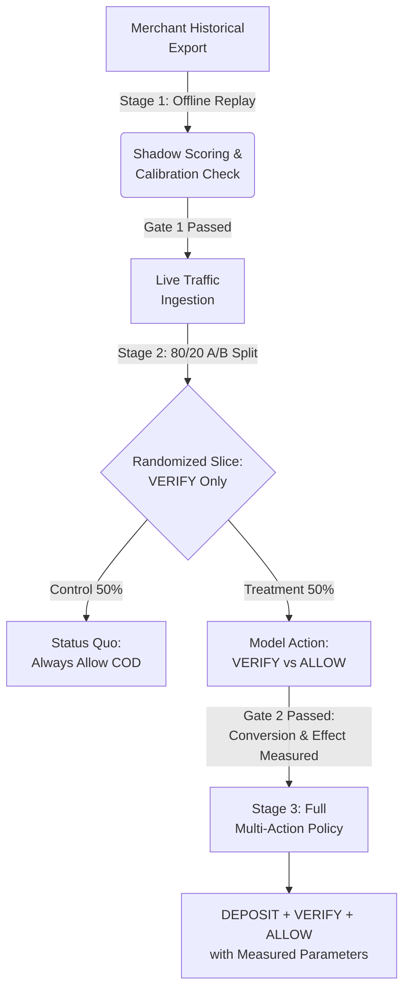

# Pilot Design & Real-World Validation Protocol

> **Objective:** Transition RTO Shield from synthetic validation to a real merchant production deployment safely, using a 3-stage controlled gating protocol that protects merchant revenue, validates core assumptions, and quantifies causal treatment effects without risking conversion collapse.

---

## 1. Staged Deployment Architecture



### Stage 1: Offline Shadow Replay (Zero Merchant Impact)
- **Data Source:** 30–60 days of historical merchant order data (CSV export).
- **Required Fields (Pilot Data Request):**
  - `order_id` (anonymized string)
  - `timestamp` (ISO-8601 UTC)
  - `order_value` (INR, gross basket value)
  - `payment_method` (`COD`, `UPI`, `CARD`, `NETBANKING`)
  - `cod_charge` (INR)
  - `pincode` (6-digit Indian Postal Code)
  - `category` (Apparel, Electronics, Beauty, etc.)
  - `courier_id` (Delhivery, BlueDart, Ekart, etc.)
  - `prior_orders_count` & `prior_rto_count` (lifetime per customer)
  - `account_age_days`
  - `ground_truth_outcome` (`DELIVERED`, `RTO`, `RETURN_AFTER_DELIVERY`, `CANCELLED_PRE_DISPATCH`)
- **Execution:**
  1. Score all COD orders historically without serving interventions.
  2. Compute merchant-specific base COD RTO rate and evaluate break-even gate:
     ```python
     net_savings = simulate_frozen_policy(merchant_baskets, merchant_costs, base_rto)
     ```
  3. Verify merchant break-even: If merchant base RTO < 16.6%, block friction and log reason.
  4. Inspect calibration curve and compute empirical Brier score, ECE, and PR-AUC.
- **Stage 1 Exit Gate:**
  - Model PR-AUC ≥ 90% of observable ceiling on merchant data.
  - Expected net savings > 0 with $p < 0.01$.
  - Data sample contains ≥ 1,000 COD orders.

---

### Stage 2: Randomized Slice — VERIFY Only (Low-Risk Live Trial)
- **Constraint:** **No deposit friction permitted.** Only `VERIFY_ADDRESS` (SMS/WhatsApp OTP/IVR address confirmation) or `ALLOW_COD`.
- **Traffic Slice:** 20% of live COD orders entering checkout.
- **Randomization:** Order-level deterministic hashing (`sha256(order_id + salt) % 100`):
  - **Control Arm (50% of slice):** Status Quo (100% `ALLOW_COD`, zero friction).
  - **Treatment Arm (50% of slice):** RTO Shield routing (`VERIFY_ADDRESS` if $p \ge p^*_{\text{verify}}$, else `ALLOW_COD`).
- **Measurements Captured:**
  - Verification drop-off rate ($\delta_{\text{verify}}$): fraction of customers who abandon checkout when prompted for address verification.
  - Causal RTO reduction ($\Delta_{\text{verify}}$): difference in delivery success between verified orders and control.
  - Verification friction cost ($C_{\text{friction}}$): actual WhatsApp/SMS API provider charge per prompt (₹1.50–₹2.50).

---

### Stage 3: Full Multi-Action Policy (Deposit Activation)
- **Constraint:** Activated **only after Stage 2 empirically confirms** that drop-off ≤ 8% and verification delivers positive net margin.
- **Actions Enabled:** `ALLOW_COD`, `VERIFY_ADDRESS`, `REQUIRE_DEPOSIT`.
- **Parameter Replacement:** Frozen cost engine constants are updated with empirical Stage 2 measurements.
- **Holdout Control:** A continuous 10% global holdout arm is maintained to monitor long-term customer lifetime value (LTV) and ensure no latent brand churn.

---

## 2. Statistical Power & Sample Size Calculation

To detect a minimum clinically meaningful RTO reduction from baseline $p_1 = 0.28$ (28%) down to $p_2 = 0.23$ (23%, a 5 percentage point absolute reduction) at **80% statistical power** ($\beta = 0.20$) and **5% significance** ($\alpha = 0.05$, two-sided):

### Closed-Form Formula (Two-Proportion Z-Test)
$$N_{\text{arm}} = \frac{\left(Z_{\alpha/2}\sqrt{2\bar{p}(1-\bar{p})} + Z_{\beta}\sqrt{p_1(1-p_1) + p_2(1-p_2)}\right)^2}{(p_1 - p_2)^2}$$

Where:
- $Z_{\alpha/2} = 1.960$ (for 95% confidence)
- $Z_{\beta} = 0.842$ (for 80% power)
- $p_1 = 0.280$
- $p_2 = 0.230$
- $\bar{p} = \frac{p_1 + p_2}{2} = 0.255$

### Calculation:
1. $2\bar{p}(1-\bar{p}) = 2(0.255)(0.745) = 0.37995 \implies \sqrt{0.37995} \approx 0.6164$
2. $Z_{\alpha/2} \times 0.6164 = 1.960 \times 0.6164 = 1.2081$
3. $p_1(1-p_1) + p_2(1-p_2) = (0.28)(0.72) + (0.23)(0.77) = 0.2016 + 0.1771 = 0.3787 \implies \sqrt{0.3787} \approx 0.6154$
4. $Z_{\beta} \times 0.6154 = 0.842 \times 0.6154 = 0.5182$
5. Numerator $= (1.2081 + 0.5182)^2 = (1.7263)^2 \approx 2.980$
6. Denominator $= (0.28 - 0.23)^2 = (0.05)^2 = 0.0025$
7. $N_{\text{arm}} = \frac{2.980}{0.0025} \approx \mathbf{1,192\text{ orders}}$
8. **Total Sample Size:** $2 \times 1,192 \approx \mathbf{2,384\text{ orders}}$

At 500 COD orders/day on a 20% slice (100 orders/day in pilot):
$$\text{Duration} = \frac{2,384}{100} \approx \mathbf{24\text{ days}}$$

---

## 3. Automated Stopping Rules (Circuit Breakers)

The pilot engine evaluates circuit breakers hourly. Any trigger automatically engages the **Kill Switch** (`ProductionGuardrails.activate_kill_switch()`), instantly reverting 100% of traffic to status quo `ALLOW_COD`:

| Trigger | Metric Threshold | Evaluation Window | Action Taken |
|---|---|---|---|
| **Conversion Collapse** | Funnel checkout completion drops > 3.0% vs control | Rolling 24 hours | Kill switch trip; alert merchant oncall |
| **Excessive Drop-off** | Verification prompt abandonment > 10.0% | Rolling 100 interventions | Freeze `VERIFY_ADDRESS`, fallback to `ALLOW_COD` |
| **Financial Net Loss** | Realized cumulative margin in Treatment < Control by ≥ ₹15,000 | Cumulative since launch | Kill switch trip; full post-mortem audit |
| **Model Drift** | Observed RTO rate exceeds model-predicted $P$ by > 8.0% | Rolling 500 orders | Trigger recalibration; disable interventions |
| **Ops Latency Spill** | p95 inference latency > 50 ms | 5-minute rolling window | Bypass scoring, return passthrough |

---

## 4. Parameter Replacement Matrix

Assumed synthetic parameters vs actual empirical values that replace them during the pilot:

| Engine Parameter | Synthetic Baseline Value | Empirical Pilot Metric | Measurement Method |
|---|---|---|---|
| **Verification Drop-off** | $\delta_{\text{verify}} = 0.05$ (5%) | $\delta_{\text{verify}}^{\text{obs}}$ | Prompted vs Completed OTPs in Stage 2 |
| **Verification RTO Reduction** | $\Delta_{\text{verify}} = 0.20$ (20%) | $\Delta_{\text{verify}}^{\text{obs}}$ | Control RTO rate minus Treatment RTO rate |
| **Deposit Drop-off** | $\delta_{\text{deposit}} = 0.50$ (50%) | $\delta_{\text{deposit}}^{\text{obs}}$ | Partial prepayment gateway drop-off in Stage 3 |
| **Deposit RTO Reduction** | $\Delta_{\text{deposit}} = 0.60$ (60%) | $\Delta_{\text{deposit}}^{\text{obs}}$ | Delivery rate on deposit-paid orders vs control |
| **Forward Delivery Cost** | $C_{\text{delivery}}$ = ₹0 (assumed free) | $C_{\text{delivery}}^{\text{obs}}$ | Merchant carrier invoice (typically ₹40–₹70/order) |
| **Reverse Logistics Cost** | $C_{\text{rto}}$ = ₹150 | $C_{\text{rto}}^{\text{obs}}$ | Carrier freight + reverse manifest + repackaging fee |
| **Net Gross Margin** | $m = 0.20$ (20%) | $m_{\text{obs}}$ | SKU-level gross margin exported from ERP |
| **Friction / WhatsApp Fee** | $C_{\text{friction}}$ = ₹2.00 | $C_{\text{friction}}^{\text{obs}}$ | Per-message conversation API billing from Meta BSP |
